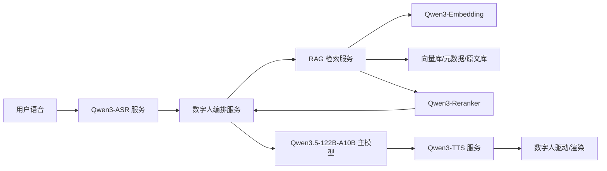
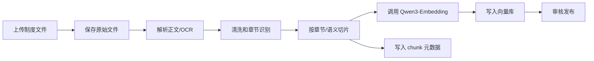
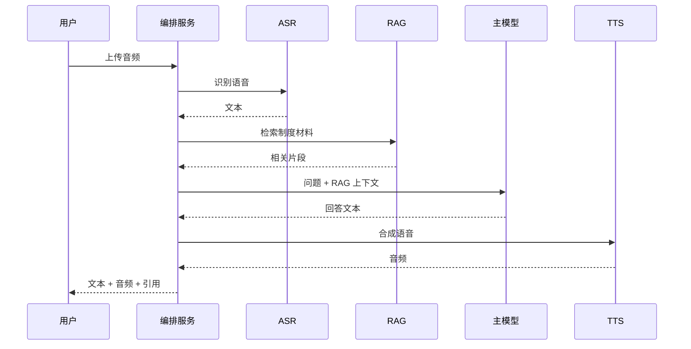

# Qwen 数字人 ASR、TTS、RAG 部署流程文档

版本：v0.1  
日期：2026-06-08  
适用环境：Atlas 800T A2、ARM 架构、麒麟 V10、昇腾 910B-3 64GB  
目标场景：已部署 Qwen3.5-122B-A10B 主大模型，继续补齐数字人所需的 ASR、TTS、RAG 能力

## 1. 结论

可以采用“全 Qwen 模型路线”。推荐组合如下：

| 能力 | 推荐模型 | 首选部署方式 | 说明 |
| --- | --- | --- | --- |
| 对话大模型 | 已部署 Qwen3.5-122B-A10B | 沿用现有服务 | 作为数字人大脑，负责对话生成、制度问答生成 |
| ASR | Qwen3-ASR-1.7B，低资源可用 Qwen3-ASR-0.6B | vLLM-Ascend | Qwen 官方开源 ASR，支持中英、多语种、方言、流式/离线识别 |
| TTS | Qwen3-TTS-12Hz-1.7B-CustomVoice / VoiceDesign / Base | vLLM-Omni on Ascend NPU | CustomVoice 适合固定音色，VoiceDesign 适合自然语言描述音色，Base 适合参考音频克隆 |
| RAG Embedding | Qwen3-Embedding-0.6B，效果优先可用 4B/8B | vLLM-Ascend | 制度文档检索建议先用 0.6B 做 PoC，效果不足再升 4B |
| RAG Reranker | Qwen3-Reranker-0.6B，效果优先可用 4B | vLLM-Ascend | 建议必须上 Reranker，制度问答更容易命中准确条款 |

需要注意：RAG 不是只部署模型，还需要文档解析、向量库、元数据表、原文存储、权限管理和更新流程。Qwen 负责 embedding、rerank 和最终回答；文件和向量仍然需要数据库/存储服务承载。

## 2. 资源申请建议

当前项目只有 2 张 910B-3 64GB，且 Qwen3.5-122B-A10B 已部署。若这两张卡已经用于主模型推理，不建议继续把 ASR、TTS、Embedding、Reranker 全部挤在同一组卡上。

### 2.1 推荐申请

| 资源 | 推荐规格 | 用途 | 申请理由 |
| --- | --- | --- | --- |
| 额外 NPU 卡 | 再划拨 2 张 910B-3 64GB | ASR、TTS、Embedding、Reranker | 数字人是实时链路，ASR/TTS 与主模型抢卡会明显增加延迟 |
| CPU/存储服务器 | 32 核 CPU、128GB 内存、2TB NVMe 起步 | RAG 文件库、向量库、元数据、解析/OCR、后台服务 | RAG 数据层主要吃 CPU、内存、SSD 和备份，不需要长期占用 NPU |
| 备份/NAS | 4TB 起步 | 原始制度文件、解析正文、向量库备份、日志归档 | 制度文件属于业务知识资产，需要可恢复和可追溯 |
| 内网 | 10GbE 推荐 | 主模型、ASR、TTS、RAG 服务互通 | 降低音频和检索链路延迟 |

### 2.2 最小 PoC 配置

资源紧张时，可以先做 PoC：

| 资源 | 最小配置 | 限制 |
| --- | --- | --- |
| NPU | 现有 2 张卡先不新增 | 需要确认主模型显存余量；不适合并发和生产实时体验 |
| CPU/存储 | 可以暂放在同一台服务器 | 文档解析、向量库和推理服务相互影响，后续迁移成本较高 |
| 模型 | ASR/TTS/Embedding/Reranker 均选 0.6B 或低并发部署 | 效果和并发能力有限 |

建议资源申请口径：

> 为保障数字人实时交互体验，现有 2 张 910B-3 64GB 继续用于 Qwen3.5-122B-A10B 主大模型推理。申请额外 2 张 910B-3 64GB 用于 Qwen3-ASR、Qwen3-TTS、Qwen3-Embedding、Qwen3-Reranker 服务化部署。另申请 1 台 CPU/存储服务器用于 RAG 文档库、向量数据库、元数据管理、原文存储、解析/OCR、日志与备份，避免数据库 IO 和文档处理影响主模型推理稳定性。

## 3. 推荐拓扑

### 3.1 生产推荐



### 3.2 服务划分

| 服务 | 建议端口 | 部署位置 | 说明 |
| --- | --- | --- | --- |
| 主模型服务 | 8000 | NPU 服务器 | 已有 Qwen3.5-122B-A10B |
| ASR 服务 | 8010 | NPU 服务器 | OpenAI compatible chat/completions 或内部封装 API |
| TTS 服务 | 8020 | NPU 服务器 | `/v1/audio/speech`，支持 wav/pcm/stream |
| Embedding 服务 | 8030 | NPU 服务器 | `/v1/embeddings` |
| Reranker 服务 | 8040 | NPU 服务器 | `/v1/rerank` |
| RAG API | 8050 | CPU/存储服务器 | 文档入库、检索、权限过滤、召回拼装 |
| RAG 管理后台 | 8060 | CPU/存储服务器 | 上传制度、版本管理、重建索引、审核发布 |
| 向量库/数据库 | 内网端口 | CPU/存储服务器 | openGauss、Milvus 或其他内网数据库 |

端口只是建议，最终以现有运维规范为准。

## 4. NPU 分配建议

若项目可使用 4 张卡：

| 卡 | 服务 | 说明 |
| --- | --- | --- |
| NPU 0-1 | Qwen3.5-122B-A10B | 已有主模型服务 |
| NPU 2 | Qwen3-ASR-1.7B + Qwen3-Embedding-0.6B | 低并发可共用；高并发时拆卡 |
| NPU 3 | Qwen3-TTS-1.7B + Qwen3-Reranker-0.6B | TTS 对实时体验敏感，优先保障 |

若项目只能继续使用 2 张卡：

1. 先确认主模型实际显存占用和吞吐余量。
2. ASR、TTS、Embedding、Reranker 全部选择小模型。
3. 优先保障数字人链路：ASR 和 TTS 高优先级，RAG 建库任务离线执行。
4. Reranker 可先低并发调用，或者只在制度问答场景触发。

生产上线不建议长期采用 2 卡全压方案。

## 5. 部署前准备

### 5.1 基础检查

在麒麟 V10 服务器上确认：

```bash
uname -a
cat /etc/os-release
arch
npu-smi info
docker --version
docker info | grep -i runtime
```

需要确认：

| 项目 | 要求 |
| --- | --- |
| OS | 麒麟 V10，ARM64 |
| NPU | 昇腾 910B-3 64GB，设备可见 |
| 驱动/CANN | 与 vLLM-Ascend/vLLM-Omni 镜像版本匹配 |
| Docker | 支持挂载 `/dev/davinci*`、Ascend driver、dcmi、npu-smi |
| 网络 | 服务器可访问模型仓库，或已准备离线模型包 |
| 磁盘 | 模型目录、RAG 数据目录、日志目录分开 |

### 5.2 推荐目录

```bash
/data/models/qwen/
/data/rag/raw_docs/
/data/rag/parsed/
/data/rag/chunks/
/data/rag/index/
/data/rag/backups/
/data/logs/asr/
/data/logs/tts/
/data/logs/rag/
/data/logs/embedding/
/data/logs/reranker/
```

### 5.3 模型下载

内网环境建议提前通过 ModelScope 下载模型，再拷贝到服务器：

```bash
pip install -U modelscope

modelscope download --model Qwen/Qwen3-ASR-1.7B --local_dir /data/models/qwen/Qwen3-ASR-1.7B
modelscope download --model Qwen/Qwen3-ASR-0.6B --local_dir /data/models/qwen/Qwen3-ASR-0.6B

modelscope download --model Qwen/Qwen3-TTS-Tokenizer-12Hz --local_dir /data/models/qwen/Qwen3-TTS-Tokenizer-12Hz
modelscope download --model Qwen/Qwen3-TTS-12Hz-1.7B-CustomVoice --local_dir /data/models/qwen/Qwen3-TTS-12Hz-1.7B-CustomVoice
modelscope download --model Qwen/Qwen3-TTS-12Hz-1.7B-VoiceDesign --local_dir /data/models/qwen/Qwen3-TTS-12Hz-1.7B-VoiceDesign
modelscope download --model Qwen/Qwen3-TTS-12Hz-1.7B-Base --local_dir /data/models/qwen/Qwen3-TTS-12Hz-1.7B-Base

modelscope download --model Qwen/Qwen3-Embedding-0.6B --local_dir /data/models/qwen/Qwen3-Embedding-0.6B
modelscope download --model Qwen/Qwen3-Reranker-0.6B --local_dir /data/models/qwen/Qwen3-Reranker-0.6B
```

如果 0.6B 效果不足，再下载：

```bash
modelscope download --model Qwen/Qwen3-Embedding-4B --local_dir /data/models/qwen/Qwen3-Embedding-4B
modelscope download --model Qwen/Qwen3-Reranker-4B --local_dir /data/models/qwen/Qwen3-Reranker-4B
```

## 6. ASR 部署流程

推荐先部署 Qwen3-ASR-1.7B。vLLM-Ascend 官方文档中，Qwen3-ASR-1.7B BF16 需要 1 张 910B 64GB。

### 6.1 启动容器

示例使用 `/dev/davinci2`，实际设备号按分配情况调整：

```bash
export IMAGE=quay.io/ascend/vllm-ascend:v0.20.2rc1

docker run --rm \
  --name qwen3-asr \
  --shm-size=1g \
  --device /dev/davinci2 \
  --device /dev/davinci_manager \
  --device /dev/devmm_svm \
  --device /dev/hisi_hdc \
  -v /usr/local/dcmi:/usr/local/dcmi \
  -v /usr/local/bin/npu-smi:/usr/local/bin/npu-smi \
  -v /usr/local/Ascend/driver/lib64/:/usr/local/Ascend/driver/lib64/ \
  -v /usr/local/Ascend/driver/version.info:/usr/local/Ascend/driver/version.info \
  -v /etc/ascend_install.info:/etc/ascend_install.info \
  -v /data/models:/data/models \
  -v /data/logs/asr:/data/logs/asr \
  -p 8010:8010 \
  -it $IMAGE bash
```

### 6.2 启动 ASR 服务

```bash
vllm serve /data/models/qwen/Qwen3-ASR-1.7B \
  --tensor-parallel-size 1 \
  --max-model-len 4096 \
  --gpu-memory-utilization 0.9 \
  --enforce-eager \
  --host 0.0.0.0 \
  --port 8010
```

### 6.3 验证

```bash
curl http://127.0.0.1:8010/v1/chat/completions \
  -H "Content-Type: application/json" \
  -d '{
    "messages": [
      {
        "role": "user",
        "content": [
          {
            "type": "audio_url",
            "audio_url": {
              "url": "https://qianwen-res.oss-cn-beijing.aliyuncs.com/Qwen3-ASR-Repo/asr_zh.wav"
            }
          }
        ]
      }
    ]
  }'
```

验收标准：

| 指标 | PoC 标准 | 生产建议 |
| --- | --- | --- |
| 普通话识别 | 可正确识别核心内容 | CER/WER 用内部语音样本评估 |
| 方言/噪声 | 样例可用 | 建立业务音频测试集 |
| 延迟 | 可接受 | 数字人链路中 ASR 端到端尽量低于 1 秒到 2 秒 |
| 稳定性 | 连续 30 分钟无异常 | 连续压测 24 小时 |

## 7. TTS 部署流程

TTS 推荐先用 Qwen3-TTS-12Hz-1.7B-CustomVoice。它适合数字人固定音色场景。若需要基于参考音频克隆，用 Base；若需要用自然语言描述音色，用 VoiceDesign。

### 7.1 启动 vLLM-Omni NPU 容器

示例使用 `/dev/davinci3`：

```bash
export IMAGE=quay.io/ascend/vllm-omni:v0.18.0

docker run --rm \
  --name qwen3-tts \
  --shm-size=1g \
  --device /dev/davinci3 \
  --device /dev/davinci_manager \
  --device /dev/devmm_svm \
  --device /dev/hisi_hdc \
  -v /usr/local/dcmi:/usr/local/dcmi \
  -v /usr/local/bin/npu-smi:/usr/local/bin/npu-smi \
  -v /usr/local/Ascend/driver/lib64/:/usr/local/Ascend/driver/lib64/ \
  -v /usr/local/Ascend/driver/version.info:/usr/local/Ascend/driver/version.info \
  -v /etc/ascend_install.info:/etc/ascend_install.info \
  -v /data/models:/data/models \
  -v /data/logs/tts:/data/logs/tts \
  -p 8020:8020 \
  -it $IMAGE bash
```

### 7.2 启动 TTS 服务

固定音色：

```bash
vllm serve /data/models/qwen/Qwen3-TTS-12Hz-1.7B-CustomVoice \
  --deploy-config vllm_omni/deploy/qwen3_tts.yaml \
  --omni \
  --trust-remote-code \
  --enforce-eager \
  --host 0.0.0.0 \
  --port 8020
```

自然语言设计音色：

```bash
vllm serve /data/models/qwen/Qwen3-TTS-12Hz-1.7B-VoiceDesign \
  --deploy-config vllm_omni/deploy/qwen3_tts.yaml \
  --omni \
  --trust-remote-code \
  --enforce-eager \
  --host 0.0.0.0 \
  --port 8020
```

参考音频克隆：

```bash
vllm serve /data/models/qwen/Qwen3-TTS-12Hz-1.7B-Base \
  --deploy-config vllm_omni/deploy/qwen3_tts.yaml \
  --omni \
  --trust-remote-code \
  --enforce-eager \
  --host 0.0.0.0 \
  --port 8020
```

### 7.3 验证 TTS

```bash
curl -X POST http://127.0.0.1:8020/v1/audio/speech \
  -H "Content-Type: application/json" \
  -d '{
    "input": "您好，我是数字人助手。请问有什么可以帮您？",
    "voice": "vivian",
    "language": "Chinese",
    "response_format": "wav"
  }' \
  --output output.wav
```

流式 PCM 验证：

```bash
curl -X POST http://127.0.0.1:8020/v1/audio/speech \
  -H "Content-Type: application/json" \
  -d '{
    "input": "这是一段流式语音合成测试。",
    "voice": "vivian",
    "language": "Chinese",
    "stream": true,
    "response_format": "pcm"
  }' \
  --no-buffer > output.pcm
```

验收标准：

| 指标 | PoC 标准 | 生产建议 |
| --- | --- | --- |
| 音色 | 固定音色可接受 | 确认品牌人设、音色授权、音频风格 |
| 情感/语速 | 可通过 prompt 或参数控制 | 建立常用播报风格模板 |
| 首包延迟 | 可接受 | 数字人实时交互中尽量压低首包时间 |
| 稳定性 | 连续 30 分钟 | 长时间压测和多轮对话压测 |

## 8. RAG 模型部署流程

RAG 模型层使用 Qwen3-Embedding 和 Qwen3-Reranker。

### 8.1 Embedding 服务

```bash
vllm serve /data/models/qwen/Qwen3-Embedding-0.6B \
  --runner pooling \
  --host 0.0.0.0 \
  --port 8030
```

验证：

```bash
curl http://127.0.0.1:8030/v1/embeddings \
  -H "Content-Type: application/json" \
  -d '{
    "input": [
      "员工请假管理制度",
      "差旅报销需要提前审批"
    ]
  }'
```

### 8.2 Reranker 服务

```bash
vllm serve /data/models/qwen/Qwen3-Reranker-0.6B \
  --host 0.0.0.0 \
  --port 8040 \
  --hf_overrides '{"architectures": ["Qwen3ForSequenceClassification"], "classifier_from_token": ["no", "yes"], "is_original_qwen3_reranker": true}'
```

验证：

```bash
curl http://127.0.0.1:8040/v1/rerank \
  -H "Content-Type: application/json" \
  -d '{
    "query": "员工年假怎么申请？",
    "documents": [
      "员工年假申请需提前三天在系统提交，并由直属上级审批。",
      "差旅报销需在返回后七个工作日内提交发票。"
    ]
  }'
```

实际生产中，建议按 Qwen3-Reranker 文档要求包装 query、instruction、document 模板，以提升排序效果。

## 9. RAG 数据层部署

### 9.1 数据组件

推荐组件：

| 组件 | 推荐选型 | 说明 |
| --- | --- | --- |
| 元数据数据库 | openGauss / PostgreSQL | 保存文件、版本、权限、chunk 元数据 |
| 向量库 | openGauss 向量能力 / Milvus | 保存 embedding 向量和 ANN 索引 |
| 原文存储 | 本地文件系统 / NAS / 对象存储 | 保存 Word、PDF、扫描件、解析结果 |
| 后台 API | FastAPI / Spring Boot | 文档上传、解析、入库、检索、管理 |
| 任务队列 | Redis / RabbitMQ / 数据库任务表 | 异步解析、embedding、重建索引 |

如果制度文档规模不大，先用单机数据库即可；文档量大、并发高时再拆向量库集群。

### 9.2 数据表建议

核心表：

| 表 | 作用 |
| --- | --- |
| `kb_document` | 文件主表，保存标题、来源、版本、状态、权限范围 |
| `kb_document_version` | 文件版本表，保留每次上传和解析结果 |
| `kb_chunk` | 文档切片表，保存 chunk 文本、页码、章节、hash |
| `kb_embedding` | 向量表，保存 chunk_id、embedding、模型版本 |
| `kb_ingest_task` | 入库任务表，保存解析、切片、向量化状态 |
| `kb_query_log` | 问答日志表，保存问题、命中 chunk、回答、用户反馈 |

### 9.3 入库流程



切片建议：

| 类型 | 建议 |
| --- | --- |
| 管理制度、办法 | 优先按章、条、款切分 |
| PDF 扫描件 | OCR 后保留页码和截图定位 |
| 表格类制度 | 表格转 Markdown，并保留表头 |
| chunk 长度 | 300 到 800 中文字起步 |
| overlap | 50 到 100 中文字 |
| metadata | 文件名、版本、章节、页码、权限、发布时间 |

### 9.4 检索流程


检索参数建议：

| 参数 | PoC 值 | 说明 |
| --- | --- | --- |
| `top_k` | 20 到 50 | 向量召回候选 |
| `top_n` | 3 到 8 | Reranker 后进入主模型的片段数 |
| `score_threshold` | 先不固定 | 先收集日志再设阈值 |
| `chunk_max_chars` | 800 | 避免 prompt 过长 |
| `answer_with_citation` | true | 制度问答必须带来源 |

### 9.5 制度问答 Prompt 模板

```text
你是公司制度问答助手。请只根据给定的制度材料回答问题。

要求：
1. 如果材料中没有明确依据，请回答“当前知识库未找到明确依据”，不要编造。
2. 回答要简洁，优先给出办理条件、流程、时限、责任部门。
3. 必须列出引用来源，包括制度名称、章节/条款、页码或段落。
4. 如果不同制度版本存在冲突，优先使用状态为“已发布”的最新版本。

用户问题：
{question}

制度材料：
{retrieved_chunks}
```

## 10. 数字人编排服务

数字人编排服务负责把 ASR、RAG、主模型、TTS 串起来。

### 10.1 同步接口

适合 PoC：



### 10.2 流式接口

生产数字人建议逐步改为流式：

1. ASR 流式出中间文本。
2. 编排服务判断句子结束后触发 RAG。
3. 主模型流式输出回答文本。
4. TTS 按句子分段合成，先出首句音频。
5. 数字人渲染侧按 PCM/WAV 分片驱动口型和动作。

## 11. 部署顺序

建议按以下顺序推进：

### 第 1 阶段：环境和单模型验证

1. 确认 NPU、驱动、CANN、Docker Runtime 可用。
2. 确认现有 Qwen3.5-122B-A10B 服务可通过内网 API 调用。
3. 部署 Qwen3-ASR，完成普通话、业务噪声样本验证。
4. 部署 Qwen3-TTS，确认音色、首包延迟、流式输出。
5. 部署 Qwen3-Embedding 和 Qwen3-Reranker，确认 API 可用。

### 第 2 阶段：RAG PoC

1. 准备 20 到 50 份典型管理制度。
2. 完成 PDF/Word 解析和 chunk 切分。
3. 调用 Qwen3-Embedding 写入向量库。
4. 接入 Qwen3-Reranker。
5. 建立 50 到 100 条制度问答测试集。
6. 验证回答准确率、引用准确率、拒答能力。

### 第 3 阶段：数字人联调

1. 编排服务串联 ASR、RAG、主模型、TTS。
2. 对接数字人渲染引擎。
3. 优化回答分句、TTS 流式输出、口型同步。
4. 记录端到端耗时：ASR、RAG、LLM、TTS、渲染分段统计。
5. 加入异常兜底：ASR 失败、RAG 无结果、主模型超时、TTS 失败。

### 第 4 阶段：生产化

1. 加权限控制：按部门、角色、制度范围过滤文档。
2. 加审核发布流程：上传、解析、预览、审核、发布。
3. 加日志审计：问题、命中文档、回答、引用、用户反馈。
4. 加监控告警：NPU 利用率、显存、延迟、错误率、队列堆积。
5. 加备份恢复：数据库、向量索引、原始文件、配置。

## 12. 验收清单

### 12.1 ASR

| 项目 | 标准 |
| --- | --- |
| 普通话识别 | 业务样本核心语义准确 |
| 噪声识别 | 会议室、远场、环境噪声下可用 |
| 流式能力 | 可以输出中间结果或短句结果 |
| 接口稳定性 | 连续调用无明显内存泄漏 |

### 12.2 TTS

| 项目 | 标准 |
| --- | --- |
| 音色 | 符合数字人人设 |
| 情感 | 支持正式、亲和、提示、道歉等常见语气 |
| 首包延迟 | 满足数字人实时体验 |
| 音频格式 | 支持数字人引擎要求的 wav/pcm/sample rate |

### 12.3 RAG

| 项目 | 标准 |
| --- | --- |
| 命中准确率 | 测试集中问题能命中正确制度条款 |
| 引用准确率 | 回答能返回制度名称、章节、页码 |
| 拒答能力 | 无依据时不编造 |
| 版本控制 | 新旧制度冲突时使用已发布最新版本 |
| 权限控制 | 用户只能检索自己可见的制度 |

### 12.4 端到端

| 项目 | 标准 |
| --- | --- |
| 语音到语音 | 用户提问后能返回语音和文本 |
| 制度问答 | 能回答请假、报销、审批等典型问题 |
| 错误兜底 | 任一服务失败时有可理解提示 |
| 观测性 | 能按请求追踪 ASR、RAG、LLM、TTS 耗时 |

## 13. 主要风险和处理办法

| 风险 | 表现 | 处理 |
| --- | --- | --- |
| 2 张 NPU 不够 | 主模型、ASR、TTS 抢资源，延迟高 | 申请额外 2 张卡；ASR/TTS/RAG 小模型先跑 PoC |
| TTS 服务化成熟度 | 版本适配、流式首包、音频格式问题 | 固定 vLLM-Omni、vLLM-Ascend、CANN 版本；先验收单模型 |
| RAG 答案不准 | 找到相似但不相关条款 | 上 Reranker；优化切片；保留章节层级 |
| 制度版本混乱 | 回答引用旧制度 | 建版本状态、发布时间、发布审核 |
| 内网无法下载模型 | 容器启动时拉权重失败 | 提前离线下载 ModelScope 权重，统一挂载 `/data/models` |
| 文档解析质量差 | PDF 表格、扫描件丢信息 | 表格转 Markdown；扫描件 OCR；重要制度人工抽检 |

## 14. 运维建议

1. 所有模型服务加健康检查接口。
2. 所有请求带 `request_id`，贯穿 ASR、RAG、LLM、TTS。
3. NPU 服务使用固定镜像版本，不在生产容器里临时升级依赖。
4. RAG 入库任务异步执行，避免上传文件时阻塞管理后台。
5. 每次制度更新后保留旧版本，支持回滚。
6. 对主模型回答进行日志抽检，重点检查制度引用是否准确。
7. 上线前准备 100 条以上业务问答集做回归测试。

## 15. 参考资料

以下资料用于确认模型和昇腾部署路线，部署时应以项目实际 CANN、驱动、vLLM-Ascend、vLLM-Omni 版本为准。

| 主题 | 地址 |
| --- | --- |
| Qwen3-ASR 官方仓库 | https://github.com/QwenLM/Qwen3-ASR |
| Qwen3-TTS 官方仓库 | https://github.com/QwenLM/Qwen3-TTS |
| Qwen3-Embedding / Reranker 官方仓库 | https://github.com/QwenLM/Qwen3-Embedding |
| vLLM-Ascend Qwen3-ASR-1.7B 部署文档 | https://docs.vllm.ai/projects/ascend/en/main/tutorials/models/Qwen3-ASR-1.7B.html |
| vLLM-Ascend Qwen3-Embedding 部署文档 | https://docs.vllm.ai/projects/ascend/en/latest/tutorials/models/Qwen3_embedding.html |
| vLLM-Ascend Qwen3-Reranker 部署文档 | https://docs.vllm.ai/projects/ascend/en/latest/tutorials/models/Qwen3_reranker.html |
| vLLM-Omni NPU 安装文档 | https://docs.vllm.ai/projects/vllm-omni/en/latest/getting_started/installation/npu/ |
| vLLM-Omni 支持模型矩阵 | https://docs.vllm.ai/projects/vllm-omni/en/latest/models/supported_models/ |
| vLLM-Omni TTS Speech API | https://docs.vllm.ai/projects/vllm-omni/en/stable/serving/speech_api/ |
